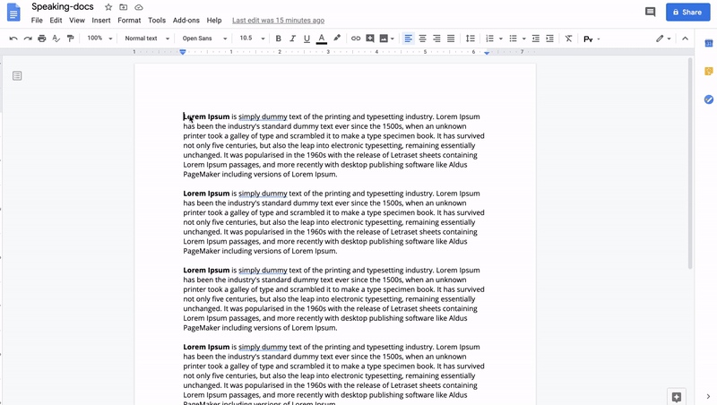

# Speaking Docs
A Google docs addon that integrates with AWS Polly.

<kbd>
    
</kbd>

## Built With
* [Google Clasp](https://github.com/google/clasp)
* [AWS SDK for JavaScript](https://github.com/aws/aws-sdk-js)

## License

[MIT](https://github.com/brieferbooks/speaking-docs/blob/master/LICENSE)
